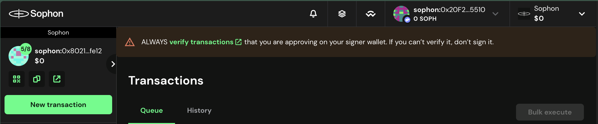
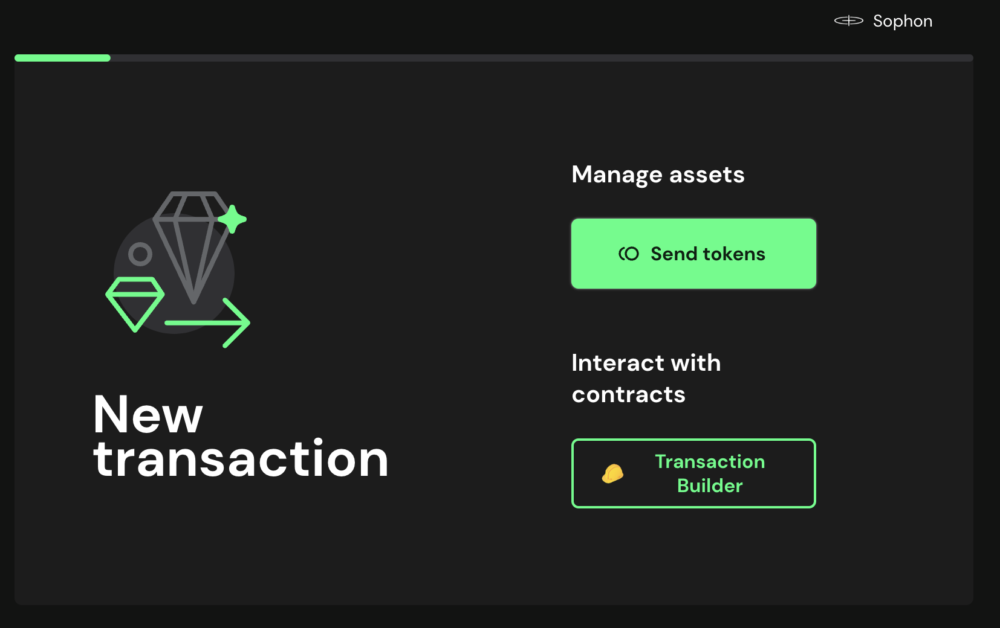
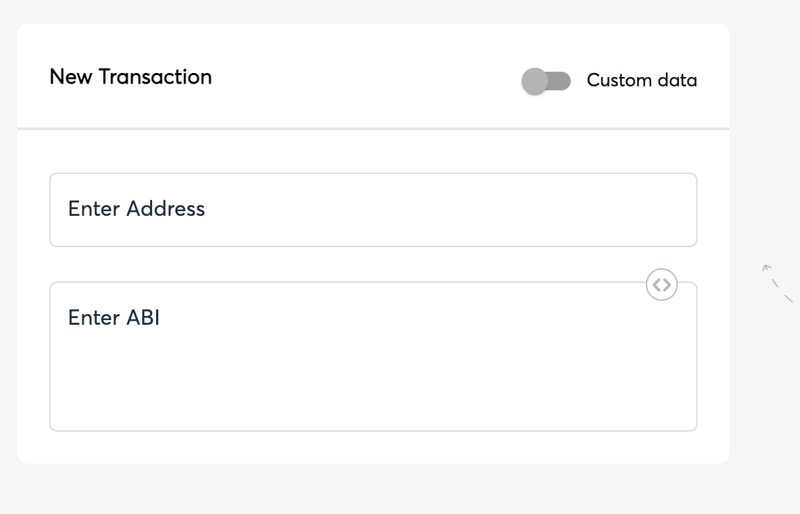
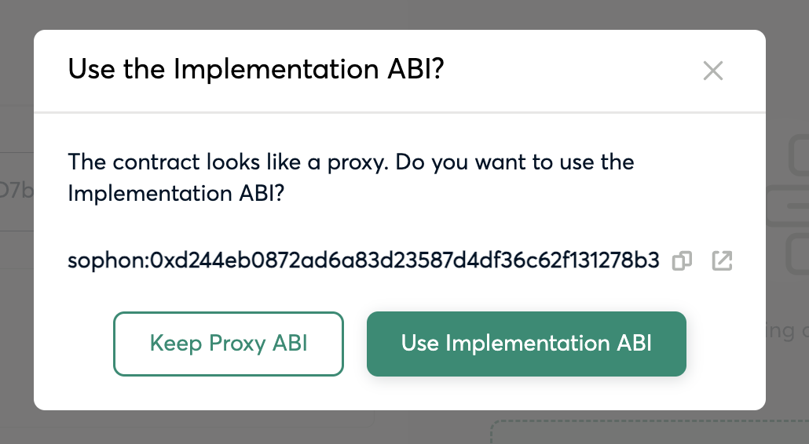
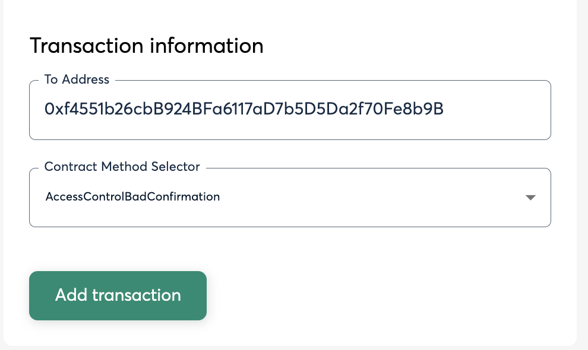
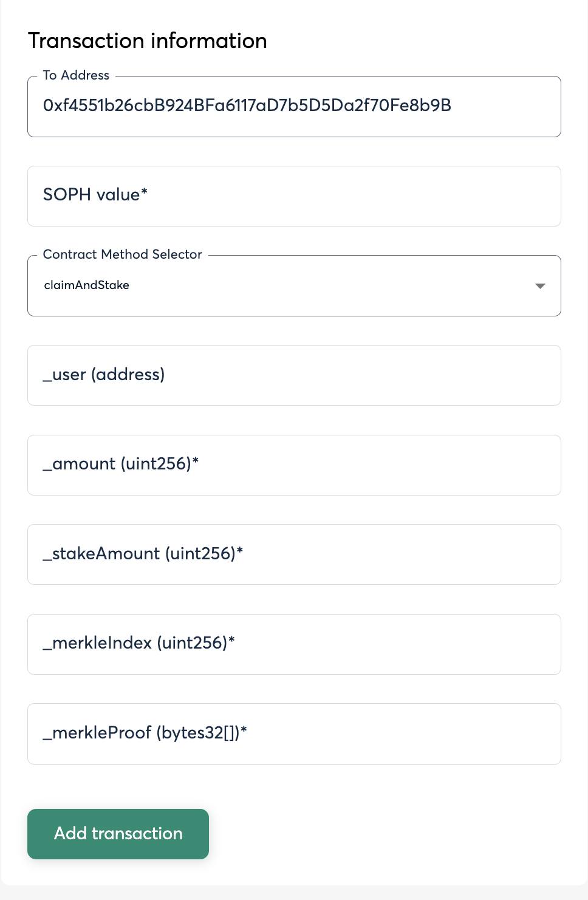

# How to programmatically claim SOPH rewards?

## 1 - Getting needed data

Open the Merkle Tree file and locate your address. Look at both files for it (it was split because of Github limits).

You will find something like this:

```json
...
{
    "address": "0xe4c06bfd663C94005B8b159Cd320Fd7976549f9b",
    "tokenAmount": "300000000000000000",
    "merkleIndex": "1",
    "merkleProof": [
      "0xeb19859777adbfa7e5d5ce2c60353f1d0c7a8454c313fc3398f004483f6de228",
      "0x9335c3f944e5ddf6e9da97cf0ee568c5d08ecc6c96d5edf408bc66ad2756c780"
    ]
  },
...
```

## 2 - Claiming (2 options available)

### For (Gnosis) Safe users

1. Open your Gnosis Safe, connect your wallet (which should be one of the Safe signers), and click on the "New transaction" green button on the top left.



2. Select **Transaction Builder**



3. Insert the contract address of the Merkle Claimer contract in the form ([0xf4551b26cbB924BFa6117aD7b5D5Da2f70Fe8b9B](https://sophscan.xyz/address/0xf4551b26cbB924BFa6117aD7b5D5Da2f70Fe8b9B))



It will automatically prompt you with this:



Click on **Use Implementation ABI**

4. You should now see the **Transaction Information** form and you will need to choose wether you want to call the `claim` or the `claimAndStake` function. You will see `claimAndStake` and `claim` repeated. Use the first occurrence.



5. Finally, fill in the following parameters:



&nbsp;&nbsp;&nbsp;&nbsp;&nbsp;&nbsp;a. **`_user`** → the `address` from the file, this is your eligible address
&nbsp;&nbsp;&nbsp;&nbsp;&nbsp;&nbsp;b. **`_amount`** → the `tokenAmount` from the file
&nbsp;&nbsp;&nbsp;&nbsp;&nbsp;&nbsp;c. **`_merkleIndex`** → the `merkleIndex` from the file
&nbsp;&nbsp;&nbsp;&nbsp;&nbsp;&nbsp;d. **`_merkleProof`** → the `merkleProof` from the file

If you've chosen `claimAndStake`, you will see an additional input field (**SOPH value**), yo should set it to 0.

**Important:** When writing the merkle proof value, make sure you are including the quotation marks (\\") at the beginning and end of each value, keep the commas as separators and the brackets ([ and ]) at the beginning and end.

6. Make all signers to sign and execute

### For regular wallet users

1. Open [Sophscan explorer](https://sophscan.xyz/address/0xf4551b26cbB924BFa6117aD7b5D5Da2f70Fe8b9B#writeProxyContract#F7) and jump into the Claimer contract. Go to "Contract" → "Write as Proxy".

2. Connect your wallet using Metamask or your preferred wallet.

3. Find the `claim()` function (you will see 2 functions with the same name, it's the one that shows first, which does NOT receive a signature parameter).

4. Fill in the following parameters:

&nbsp;&nbsp;&nbsp;&nbsp;&nbsp;&nbsp;a. **`_user`** → the `address` from the file, this is your eligible address
&nbsp;&nbsp;&nbsp;&nbsp;&nbsp;&nbsp;b. **`_amount`** → the `tokenAmount` from the file
&nbsp;&nbsp;&nbsp;&nbsp;&nbsp;&nbsp;c. **`_merkleIndex`** → the `merkleIndex` from the file
&nbsp;&nbsp;&nbsp;&nbsp;&nbsp;&nbsp;d. **`_merkleProof`** → the `merkleProof` from the file

**Important:** When writing the input values, including the proof, make sure you are not including any quotation marks (") at the beginning or end of any value. The merkle proof is a continuous string of characters without any punctuation except for the commas (,) as separators. The brackets ([ and ]) should be **excluded**.

5. Sign and execute
